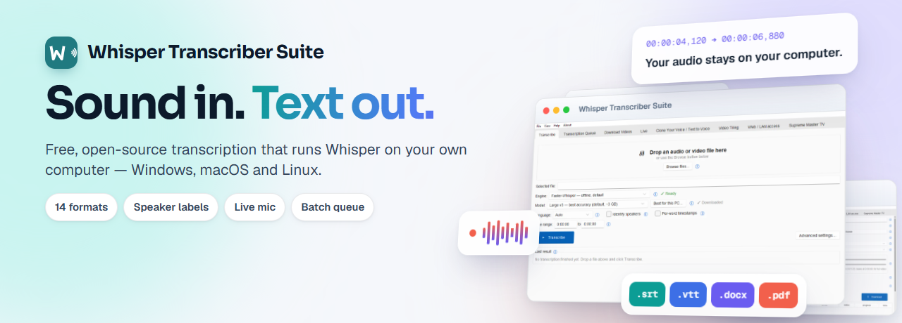
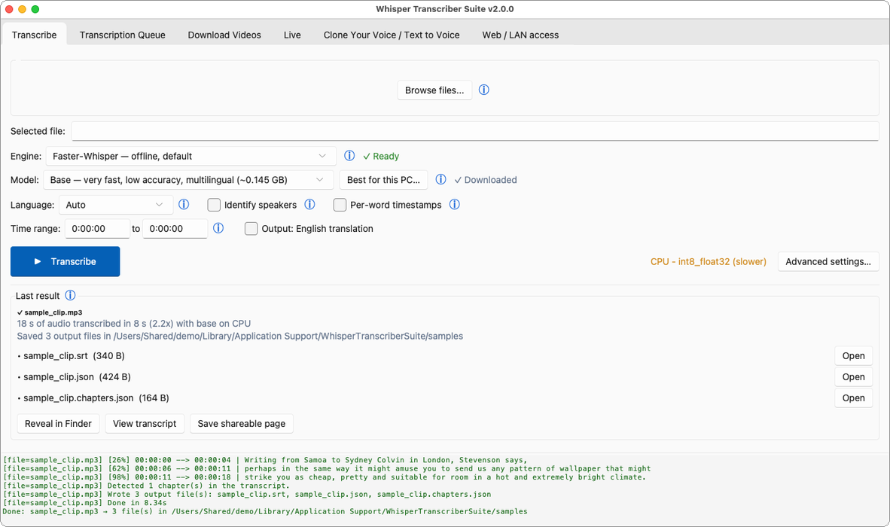

<div align="center">



# Whisper Transcriber Suite

**Free, offline transcription and subtitles for long recordings in your language — on an ordinary laptop, with no account and no audio upload.**

[](https://github.com/Milomilo777/whisper-transcriber-suite/actions/workflows/ci.yml)
[](https://github.com/Milomilo777/whisper-transcriber-suite/releases/latest)
[](LICENSE)

### [Download for Windows](https://github.com/Milomilo777/whisper-transcriber-suite/releases/latest)

macOS and Linux: see [Download](#download).

English · [简体中文](docs/i18n/README.zh-CN.md) · [日本語](docs/i18n/README.ja.md) · [한국어](docs/i18n/README.ko.md) · [Deutsch](docs/i18n/README.de.md) · [Español](docs/i18n/README.es.md) · [Français](docs/i18n/README.fr.md) · [Português](docs/i18n/README.pt.md) · [فارسی](docs/i18n/README.fa.md)

</div>

## Who it is for

Subtitlers, translators, researchers and journalists who turn long
recordings (interviews, lectures, talks, videos) into text or subtitles.
Drop in an audio or video file and the transcript is written next to it. The speech engine runs on your own computer, so there is
no per-minute cost and, once the model is downloaded, no internet connection
is needed.

<div align="center">

</div>

## Features

- **Local engines:** [faster-whisper](https://github.com/SYSTRAN/faster-whisper)
  (default), whisper.cpp and NVIDIA Parakeet, for the many languages Whisper
  recognises (the app's own interface is in English). Uses an NVIDIA GPU
  through CUDA when it can, otherwise the CPU.
- **14 output formats:** SRT, VTT, ASS, TSV, TXT, JSON, LRC, Markdown, DOCX and
  PDF, plus the oTranscribe, ELAN, InqScribe and Express Scribe formats. DOCX
  and PDF draw every script, and Persian, Arabic and Urdu read right to left
  with joined letters.
- **Shareable web page:** save a finished transcript as one `.html` file that
  works offline in any browser; click a word to hear it, search, jump to
  chapters.
- **Speaker labels** without a Hugging Face account, plus word timestamps and
  time-range clipping.
- **Interrupted jobs resume** from their last checkpoint instead of starting
  over (default engine).
- **Online videos:** download from any site [yt-dlp](https://github.com/yt-dlp/yt-dlp)
  supports and transcribe when the download finishes.
- **Link to subtitled video:** one tick turns a link into `<title>-subbed.mp4`
  with the subtitles burned in: download, transcribe and burn in one queued job
  ([docs/SUBTITLED_VIDEO.md](docs/SUBTITLED_VIDEO.md)).
- **Live:** transcribe a microphone, or the system audio on Windows, as it
  happens ([docs/LIVE.md](docs/LIVE.md)).
- **Batch queue and watched folder** for many files.
- **Local-network mode:** a transcription page and an OpenAI-compatible API for
  the other devices on your network ([docs/SERVER.md](docs/SERVER.md)).
- **Optional, off by default:** AI tools for a finished transcript (summary,
  questions, bilingual SRT), and offline text to voice with voice cloning.

How it compares with Subtitle Edit, Vibe, Buzz, noScribe and aTrain,
including when another app is the better pick:
**[docs/COMPARISON.md](docs/COMPARISON.md)**.

## Download

Latest release: **[releases page](https://github.com/Milomilo777/whisper-transcriber-suite/releases/latest)**.

| File | For |
|---|---|
| `WhisperTranscriberSuite-Installer-Windows-vX.Y.Z.exe` | Windows 10 or 11, 64-bit. Most people want this one. |
| `WhisperTranscriberSuite-Portable-Windows-vX.Y.Z.zip` | Windows without installing: unzip and run. |
| `WhisperTranscriberSuite-vX.Y.Z-macOS-arm64.dmg` | Macs with Apple silicon, macOS 14 or newer. |
| `WhisperTranscriberSuite-vX.Y.Z-macOS-x64.dmg` | Intel Macs, macOS 10.15 or newer. |

Linux runs from source: [platform/linux/README.md](platform/linux/README.md).

ffmpeg and yt-dlp are bundled. On first launch a quick start window picks
the speech model for your language: Fast (Small, about 500 MB) or Best
quality (up to about 3 GB); it downloads once, on first use. Plan for 8 GB
of RAM; on a CPU the Large models take about 1.5–2.5 times the length of
the audio and Small about half, an NVIDIA GPU is much faster. The Windows builds are not code-signed and the Mac builds are not
notarized, so SmartScreen and Gatekeeper warn on first launch;
[docs/INSTALL.md](docs/INSTALL.md) shows what to click. To update, run the
newer installer over the old one; settings are kept.

**Downloads by version** (each badge counts only that version's own
release — older versions stay published and their counts are never
reset):

[](https://github.com/Milomilo777/whisper-transcriber-suite/releases/tag/v1.9.3)
[](https://github.com/Milomilo777/whisper-transcriber-suite/releases/tag/v1.9.1)
[](https://github.com/Milomilo777/whisper-transcriber-suite/releases/tag/v1.9.0)
[](https://github.com/Milomilo777/whisper-transcriber-suite/releases/tag/v1.8.0)
[](https://github.com/Milomilo777/whisper-transcriber-suite/releases/tag/v1.7.0)
[](https://github.com/Milomilo777/whisper-transcriber-suite/releases/tag/v1.6.0)
[](https://github.com/Milomilo777/whisper-transcriber-suite/releases/tag/v1.5.0)

## What leaves your computer

With the default settings your audio and transcripts stay on your computer.
The app does use the network for:

- downloading a model or an optional component the first time it is needed;
- its online settings at startup and a daily update check on GitHub, which
  only tells you about a new version;
- usage statistics, on by default, after each finished transcription: model,
  language, durations, word count, app version, operating system, CPU and
  memory size, and region, never the file's name. Turn them off under
  **Help → Send usage statistics**.

Audio or transcript text is sent only if you choose a cloud engine (Gemini API
or Google Cloud Speech-to-Text) or connect a remote AI provider yourself.
**File → Work offline** stops all of it. Every connection is listed in
[docs/CONFIG.md](docs/CONFIG.md#network-use).

## Documentation

[Install](docs/INSTALL.md) · [Configuration](docs/CONFIG.md) ·
[Live transcription](docs/LIVE.md) · [Local-network mode and API](docs/SERVER.md) ·
[Cloud engines](docs/CLOUD_STT.md) · [Architecture](docs/ARCHITECTURE.md) ·
[Changelog](docs/CHANGELOG.md) · [All docs](docs/README.md)

## Build from source

```cmd
git clone https://github.com/Milomilo777/whisper-transcriber-suite.git
cd whisper-transcriber-suite
pip install -r requirements.txt
python gui.py
```

Needs Python 3.11 or newer. Build pipelines: [docs/BUILD.md](docs/BUILD.md). Tests and pull requests:
[CONTRIBUTING.md](CONTRIBUTING.md).

## Contributing and contact

- **Bugs and feature requests:** [GitHub Issues](https://github.com/Milomilo777/whisper-transcriber-suite/issues)
- **Questions and ideas:** [GitHub Discussions](https://github.com/Milomilo777/whisper-transcriber-suite/discussions)
- **Everything else:** by email, through the
  [Contact section of the website](https://whisper-transcriber-suite.pages.dev/#contact)
- **Security reports:** [SECURITY.md](SECURITY.md)

This project follows the [Contributor Covenant](.github/CODE_OF_CONDUCT.md).
If the app saves you time, a Star at the top of this page helps other people
find it.

## How this project is built

The maintainer develops it with heavy help from AI coding assistants (mainly Claude). Type checks
and the unit tests must pass before each commit, and CI runs them again on Windows and Linux after
every push. The [release checklist](docs/RELEASE_PROCESS.md) includes a manual install test on a
real machine. Commits made with AI help now name the model in an `Assisted-by:` line; many older
ones carry a `Co-Authored-By: Claude` line instead.

## License

Copyright (c) 2026 [translation-robot](https://github.com/translation-robot).
The project's own source is under the [BSD 3-Clause License](LICENSE). Bundled
tools, the Python runtime and the models keep their own licences; see
[THIRD_PARTY_NOTICES.md](THIRD_PARTY_NOTICES.md).
