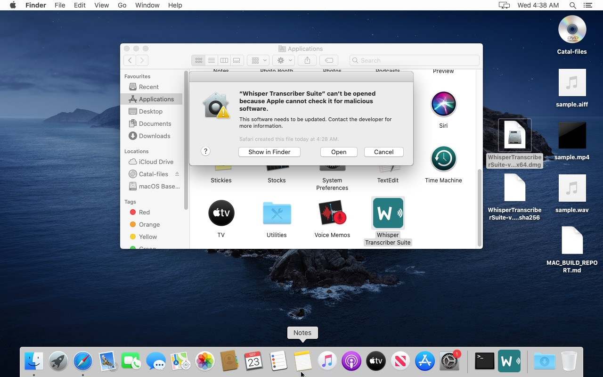

# Whisper Transcriber Suite — macOS build report (VM run)

_Run on 2026-09-23. Raw logs of every stage were in `~/buildlogs/` on the (temporary) VM; everything useful is in this
file and in [`docs/MACOS_BUILD_NOTES.md`](../MACOS_BUILD_NOTES.md)._

**Status:** x86_64 build **built, verified and tested end-to-end like a real user on macOS 10.15.7 — PASSED.**
Scope change during the run: the original brief said "local commits only, never push/release"; the owner later
explicitly asked to (1) version it 1.9.0, (2) verify on real Mac hardware via GitHub Actions, (3) push all useful
notes/fixes to `master`, and (4) publish the macOS assets as release v1.9.0. The CI/release outcome is recorded in
`docs/SESSION_HANDOFF_NEXT.md` and on the release page.

Summary of root causes of the earlier broken Mac builds (details below and in MACOS_BUILD_NOTES.md):
Homebrew ffmpeg with 18 unbundled dylibs (hypothesis **confirmed**), yt-dlp missing / destroyed by PyInstaller,
wrong/undeclared minimum macOS (wheels decide it, not `MACOSX_DEPLOYMENT_TARGET`), stale bundle version, and a
smoke test (`--help`) that could not detect any of it.

---

## Stage 0 — Environment

| Item | Value |
|---|---|
| Host | Windows 10 Enterprise, Intel i7-8550U (4C/8T), 16 GB RAM, VirtualBox 7.2.16 |
| Guest VM | 10 GB RAM, 4 vCPU, 130 GB virtual disk (host C: has only ~14 GB free — the real space limit) |
| `sw_vers` | Mac OS X **10.15.7** (19H15) — Catalina |
| `uname -m` | x86_64 |
| CPU | Intel(R) Core(TM) i7-8550U CPU @ 1.80GHz |
| AVX / AVX2 | `AVX1.0` present (cpu.features), `AVX2` present (leaf7_features) |
| RAM | 10737418240 bytes (10 GiB) |
| Free disk (guest `/`) | 93 GiB (but bounded by host free space, see above) |
| Xcode CLT | `/Library/Developer/CommandLineTools`, CLTools 12.4.0, Apple clang 12.0.0 (clang-1200.0.32.29) |
| SIP | enabled |

Access method: guest `sshd` enabled (`sudo launchctl load -w /System/Library/LaunchDaemons/ssh.plist`),
VirtualBox NAT port-forward `127.0.0.1:2222 -> 22`, key auth. All commands below were run over SSH as the VM's login user.

**Why Catalina and not newer:** the VM was created with the `myspaghetti/macos-virtualbox` script, which supports
10.13–10.15 only (Big Sur/Monterey "may" work via Software Update; Ventura+ needs OpenCore). An earlier
attempt to upgrade this VM to macOS 26 left the APFS System volume in a format Catalina's APFS driver cannot read
(`apfs_incompatible_features has unsupported flags: (0x20)`), requiring a clean reinstall. So the build is done on
10.15 — which is also the most backwards-compatible place to build an Intel app from.

---

## Stage 1 — Toolchain

```
curl -sSL -o ~/py312.pkg https://www.python.org/ftp/python/3.12.10/python-3.12.10-macos11.pkg
sudo installer -pkg ~/py312.pkg -target /        -> "The install was successful."
bash "/Applications/Python 3.12/Install Certificates.command"
/Library/Frameworks/Python.framework/Versions/3.12/bin/python3 -c "import tkinter, platform, sys; print(tkinter.TkVersion, platform.machine(), sys.version)"
  -> 8.6 x86_64 3.12.10 (v3.12.10:0cc81280367, Apr  8 2025, 08:47:00) [Clang 13.0.0 (clang-1300.0.29.30)]
file .../3.12/bin/python3
  -> Mach-O universal binary with 2 architectures: [x86_64] [arm64]
```
(3.12.10 is the last 3.12 release with a binary installer; later 3.12.x are source-only security releases.)

**Homebrew: deliberately NOT installed.** Catalina is far outside Homebrew's supported range (no bottles → every formula
builds from source; hours of CPU and many GB the host disk does not have). Everything Homebrew was meant to provide
was obtained another way (static ffmpeg from evermeet.cx; `create-dmg` replaced by plain `hdiutil`, see Stage 6).

---

## Stage 2 — Code + docs

```
git clone https://github.com/Milomilo777/whisper-transcriber-suite.git ~/wts && cd ~/wts && git switch -c mac-build-vm
HEAD at clone: bc74135 docs(handoff): record campaign merge and auto-model-pick backlog item
```
Read: CLAUDE.md, platform/macos/README.md, platform/macos/pyinstaller/README.md, whisper_project_mac.spec,
builddmg.command, .github/workflows/macos-app.yml, docs/BUILD.md (macOS parts).

Things noticed while reading (before running anything):
- `whisper_project_mac.spec` sets `LSMinimumSystemVersion = 11.0` and `version = 1.6.0` while `core.__version__ = 1.8.0`.
- The CI workflow bundles **only** `ffmpeg` + `ffprobe` copied from Homebrew — no `ffplay`, no `yt-dlp` binary.
- The CI sets `MACOSX_DEPLOYMENT_TARGET=12.0` and claims this makes the Intel build run on Monterey. That variable only
  affects code *compiled* during the build; it has **no effect on prebuilt wheels or on Homebrew bottles**, which carry
  their own minimum-OS (see Stage 3/5 findings).

---

## Stage 3 — Run from source + hermetic tests

### 3a. `install.command` — FAILED three different ways on an Intel Mac before a fix

Attempt 1: `PYTHON=/Library/Frameworks/Python.framework/Versions/3.12/bin/python3 bash platform/macos/install.command`
```
ERROR: Cannot install -r /Users/<user>/wts/requirements.txt (line 12) because these package versions have conflicting dependencies.
The conflict is caused by:
    faster-whisper 1.2.1 depends on onnxruntime<2 and >=1.14
    ...
Additionally, some packages in these conflicts have no matching distributions available for your environment:
    onnxruntime
ERROR: ResolutionImpossible
```
Root cause — onnxruntime x86_64 macOS wheels on PyPI (checked via the PyPI JSON API):

| onnxruntime | cp312 macOS wheel tags |
|---|---|
| 1.16.3 | *(no cp312 build; cp311 has `macosx_10_15_x86_64`)* |
| 1.17.0 – 1.19.2 | `macosx_11_0_universal2` |
| 1.20.0 – 1.22.1 | `macosx_13_0_universal2` |
| 1.23.0 – 1.23.2 | `macosx_13_0_x86_64` — **last release with any Intel build** |
| 1.24.1 → 1.30.0 | `macosx_14_0_arm64` only |

So: **no onnxruntime wheel for Python 3.12 installs on macOS < 11**, and a fresh `pip install` on an Intel Mac today
resolves to 1.23.2, which needs **macOS 13+**. On Apple Silicon a fresh install gets ≥1.24 → **macOS 14+**.

Workaround used on this 10.15 build host only: download the official `onnxruntime-1.19.2-cp312-cp312-macosx_11_0_universal2.whl`,
copy it under the tag `macosx_10_15_universal2`, and expose it with `PIP_FIND_LINKS`. Verified it imports and lists providers on 10.15:
`1.19.2 ['CoreMLExecutionProvider', 'AzureExecutionProvider', 'CPUExecutionProvider']` (VAD inference verified later, Stage 4).

Attempt 2 (with the onnxruntime workaround):
```
Collecting av>=11 ...
  Downloading av-18.1.0.tar.gz (4.5 MB)
      pkg-config is required for building PyAV
ERROR: Failed to build 'av' when getting requirements to build wheel
```
pip prefers the newest *sdist* over an older *wheel*; recent PyAV releases have no Intel-mac wheel for this OS.
Fix: `--prefer-binary` → picks `av-13.1.0-cp312-cp312-macosx_10_13_x86_64.whl`.

Attempt 3 (`PIP_PREFER_BINARY=1`):
```
  Building wheel for pywhispercpp (pyproject.toml): finished with status 'error'
      .../whisper.cpp/ggml/src/gguf.cpp:983:94: error: use of undeclared identifier 'errno'
  ERROR: Failed building wheel for pywhispercpp
```
There is **no x86_64 macOS wheel for pywhispercpp >= 1.4** (last Intel wheel is 1.2.0), so every Intel Mac must compile
it, and whisper.cpp's current source does not compile with CLT 12 (missing `<cerrno>` include). pywhispercpp is an
**optional** backend, and `stable-ts` (alignment, pulls torch) is optional too — but `install.command` installed
`requirements.txt` in one shot under `set -e`, so one optional failure aborted the entire install.

**Fix committed (build script only): `platform/macos/install.command`**
- install with `--prefer-binary`;
- install the required deps first, then `pywhispercpp` / `stable-ts` best-effort with a clear WARN if they fail.

Attempt 4 (fixed script, still with `PIP_FIND_LINKS` for onnxruntime on 10.15): **success**.
```
Successfully installed ... av-13.1.0 ... ctranslate2-4.6.0 faster-whisper-1.2.1 ... numpy-2.5.3 onnxruntime-1.19.2 ...
[whisper] WARN: optional 'pywhispercpp>=1.4' failed to install — that one feature stays disabled; the app still works.
Successfully installed ... numpy-2.3.5 openai-whisper-20250625 ... stable-ts-2.19.1 tiktoken-0.14.0 torch-2.2.2 torchaudio-2.2.2
Successfully installed yt-dlp-2026.8.19
[whisper] no ffmpeg + no Homebrew — fetching a static build into bin/…
[whisper] installed static ffmpeg + ffprobe into bin/
[whisper] installed static ffplay into bin/ (Video Tiling)
[whisper] installed app: /Users/<user>/Applications/Whisper Transcriber Suite.app
[whisper] installed CLI: /Users/<user>/.local/bin/whisper-transcribe
```
venv size: 1.3 GB. Note: torch 2.2.2 is the last torch with Intel-mac wheels and was built against NumPy 1.x;
with NumPy 2.3.5 it prints `UserWarning: Failed to initialize NumPy: _ARRAY_API not found` (stable-ts alignment may be affected).

### 3b. Hermetic test suite

`pytest tests/ --ignore=tests/smoke` first failed at collection: `ModuleNotFoundError: No module named 'responses'`
(`responses` is in the `dev` extra of pyproject.toml, not in the prompt's `pip install pytest pytest-timeout`).
Re-run after `pip install "responses>=0.25"`:

Run 1 (over SSH): hung forever at ~5% in
`tests/core/test_advanced_simplified.py::test_gcloud_autotest_only_runs_when_google_cloud_is_picked` inside `dlg.update()`;
pytest-timeout (thread method from pyproject `addopts`) then killed the **whole** session:
```
  File ".../tests/core/test_advanced_simplified.py", line 401, in test_gcloud_autotest_only_runs_when_google_cloud_is_picked
    dlg.update()
  File ".../tkinter/__init__.py", line 1373, in update
    self.tk.call('update')
+++++++++++++++++++++++++++++++++++ Timeout ++++++++++++++++++++++++++++++++++++
```
Run 2 (inside the logged-in GUI session via `sudo launchctl asuser 501 sudo -u <user> …`, so Tk has a real window server
connection): **same hang**. `sample <pid>` shows the main thread spinning in `CFRunLoopRunSpecific / RunCurrentEventLoopInMode`
(Tk's Cocoa event loop) and never returning to Python — so `--timeout-method=signal` cannot interrupt it either
(the Python signal handler never gets to run).

Run 3: a per-file runner (`~/buildlogs/run_pytest_perfile.py`): every test file runs in its own pytest process with
`--timeout=60 --timeout-method=thread`; a hung test is recorded, `--deselect`ed, and the file re-run.

**Result: 2580 collected → 2565 passed, 5 failed, 7 skipped, 3 hung (deselected).**

Hung (each blocks the whole run if not isolated):
```
tests/core/test_advanced_simplified.py::test_gcloud_autotest_only_runs_when_google_cloud_is_picked[faster_whisper-0]
tests/core/test_advanced_simplified.py::test_gcloud_autotest_only_runs_when_google_cloud_is_picked[google_cloud_stt-1]
tests/core/test_google_cloud_stt.py::test_transcribe_without_load_raises
```
The last one is not a Tk problem — its stack at the timeout:
```
  File "tests/core/test_google_cloud_stt.py", line 914, in test_transcribe_without_load_raises
  File "core/backends/google_cloud_stt.py", line 1201, in transcribe_to_segments
  File "core/backends/google_cloud_stt.py", line 1056, in load
  File "core/optional_deps.py", line 218, in install
  File ".../subprocess.py", line 1264, in wait
```
i.e. the test triggers a real `pip install` of the google-cloud libraries (not hermetic).

Failed:
```
FAILED tests/core/test_model_loading_dialog.py::test_dialog_geometry_screen_centres_for_minimised_parent
  E  AssertionError: expected screen-centred '+708+468', got '504x144+959+539'
FAILED tests/core/test_nvidia_asr.py::test_nvidia_asr_in_advanced_backend_choices
FAILED tests/core/test_nvidia_asr.py::test_availability_and_advanced_nvidia_asr_in_sync
  E  ImportError: cannot import name 'font' from 'tkinter' (unknown location)
FAILED tests/core/test_tray.py::test_failed_start_reports_the_tray_as_unsupported
  E  assert False is True   (where False = is_supported())
FAILED tests/core/test_tray.py::test_successful_retry_after_a_failed_start_reports_supported
  E  assert 0 == 2
```
(`test_tray.py`: app/widgets/tray.py disables the tray on `darwin` by design, so these tests can't pass on macOS.)
None of the failures involve packaging; all are app/test behaviour on macOS — documented, not changed.

---

## Stage 4 — Real transcription from source (baseline)

Test media: `say -o ~/Desktop/sample.aiff "The quick brown fox …"`, converted with the static ffmpeg to `sample.wav`, plus
`sample.mp4` (12 s black 320x240 video + that audio, libx264/aac) made before any ffmpeg removal.

Model: the default config model is **large-v3 (~3 GB)** — too big for this host's disk; switched to `small` (config.json
`model` = `Systran/faster-whisper-small`). The headless CLI does **not** download models (`[cli] Model folder missing: …
error: model not loaded`), so the model was fetched with the app's own `core.model_manager.ensure_model()` (same code the GUI's
download dialog uses): `Mirror unavailable — downloading 'Systran/faster-whisper-small' from huggingface.co … Model ready`, 28 s, 464 MB.

First CLI run from the source install — **crashed** (exit 134):
```
[cli] Model loaded
[cli] [file=sample.wav] Processing: /Users/<user>/Desktop/sample.wav
OMP: Error #15: Initializing libiomp5.dylib, but found libiomp5.dylib already initialized.
OMP: Hint This means that multiple copies of the OpenMP runtime have been linked into the program. ...
```
Cause: `stable-ts` → `torch 2.2.2` (last torch with Intel-mac wheels). torch ships `torch/lib/libiomp5.dylib`,
ctranslate2 ships `ctranslate2/.dylibs/libiomp5.dylib`, and `ctranslate2/specs/model_spec.py` imports torch whenever it is
installed (import chain: `gui.py:47 → core/transcriber.py:27 → faster_whisper → ctranslate2 → ctranslate2.specs → torch`).
So on **every Intel Mac with stable-ts installed, every transcription aborts**. (Plus torch 2.2.2 was built for NumPy 1.x:
`A module that was compiled using NumPy 1.x cannot be run in NumPy 2.3.5 …`.)
Fix committed in `install.command`: skip stable-ts on x86_64 unless `WTS_INSTALL_STABLE_TS=1`.

After `pip uninstall torch torchaudio stable-ts openai-whisper` — **success**:
```
$ ~/.local/bin/whisper-transcribe ~/Desktop/sample.wav --formats srt json --language en
[cli] [file=sample.wav] Done in 8.08s
[cli] wrote 3 output(s) next to /Users/<user>/Desktop/sample.wav   (sample.srt, sample.json, sample.chapters.json)

1  00:00:00,000 --> 00:00:04,880  The quick brown fox jumps over the lazy dog, whisper transcriber sweet is now running on
2  00:00:04,880 --> 00:00:05,880  a Mac.
3  00:00:05,880 --> 00:00:08,640  Today we are testing speech recognition with a real model.
```
Text matches (only "Suite" → "sweet", a normal ASR confusion of the synthetic voice). `vad_enabled: true`, so the Silero VAD
ran on the re-tagged onnxruntime 1.19.2 on 10.15 — confirms that wheel works on Catalina.

GUI part of Stage 4: the source-install GUI was not driven separately — the same GUI flow (model download inside the
app, transcription of wav + mp4, YouTube download) was done with the **installed frozen app** in Stage 7, which is the
stricter test. The source-install `.app` launcher was deleted before Stage 7 as instructed.

---

## Stage 6 — Build the x86_64 .app and .dmg

```
python3 -m venv .buildenv && . .buildenv/bin/activate
grep -viE '^\s*(pywhispercpp|stable-ts)' requirements.txt > /tmp/req-slim.txt      # same slimming as CI (+ pywhispercpp)
PIP_FIND_LINKS=~/dl/ort pip install --prefer-binary -r /tmp/req-slim.txt pyinstaller
  -> pyinstaller 6.22.3, numpy 2.5.3, onnxruntime 1.19.2, ctranslate2 4.6.0, av 13.1.0, tokenizers 0.22.2,
     sherpa-onnx 1.13.8, faster-whisper 1.2.1   (.buildenv = 561 MB; full freeze in ~/buildlogs/stage6_buildenv_freeze.txt)
pyinstaller --noconfirm --clean platform/macos/pyinstaller/whisper_project_mac.spec
```
Build 1 (original spec): built (604 MB .app). Findings:
- **Bundled yt-dlp broken** — 37,146,048-byte `yt-dlp_macos` became a 73,792-byte file in `Contents/Frameworks/bin/yt-dlp`:
  ```
  [PYI-7964:ERROR] Could not load PyInstaller's embedded PKG archive from the executable (.../Contents/Frameworks/bin/yt-dlp)
  ```
  yt-dlp_macos is itself a PyInstaller onefile; PyInstaller 6 re-classifies Mach-O "data" files as binaries and rewrites
  them, dropping the appended payload. (The CI workflow doesn't bundle yt-dlp at all, so its .app had no working yt-dlp either.)
- **Would not launch on 10.15**: `open "dist/Whisper Transcriber Suite.app"` →
  `LSOpenURLsWithRole() failed with error -10825` (= "requires a newer version of macOS") because the spec hard-codes
  `LSMinimumSystemVersion 11.0`, although the bundle actually runs on 10.15.
- Info.plist version `1.6.0` vs `core.__version__ = 1.8.0`.
- Frozen CLI worked, but printed
  `WhisperTranscriberSuite: error: argument command: invalid choice: 'from multiprocessing.resource_tracker import main;main(6)'`
  — gui.py never calls `multiprocessing.freeze_support()` (app code — documented, not changed), so multiprocessing's
  resource-tracker helper re-entered gui.py's argparse.

Fixes committed (spec + helpers only, no app code): see "Commits" below. Build 3 (final):
```
fetch_mac_binaries.sh:  ffmpeg/ffprobe/ffplay x86_64 minos=10.13; yt-dlp x86_64+arm64 minos=10.13; "OK: bin/ is self-contained."
WTS_MACOS_MIN=10.15 pyinstaller --noconfirm --clean platform/macos/pyinstaller/whisper_project_mac.spec
  [mac-spec] highest bundled minos: 12.0  <- _message.abi3.so
  [mac-spec] LSMinimumSystemVersion = 10.15 (WTS_MACOS_MIN override)
  [mac-spec] bundled yt-dlp 2026.08.19 (37146032 bytes, copied verbatim)
verify_mac_bundle.sh:
  Mach-O files scanned : 241
  problems             : 0
  highest minos        : 12.0  (Contents/Frameworks/google/_upb/_message.abi3.so)
  LSMinimumSystemVersion: 10.15
  ffmpeg version 9.0.2-tessus ... / yt-dlp 2026.08.19 / CLI boots / codesign --verify --deep --strict OK
  OK: bundle is self-contained.
```
Mach-O scan: **241 files, all x86_64, zero dependencies outside the bundle or /usr/lib + /System**.
minos distribution: 10.8 ×1, 10.9 ×23, 10.12 ×2, 10.13 ×210, 10.15 ×3, **11.0 ×1** (onnxruntime_pybind11_state.so),
**12.0 ×1** (protobuf `google/_upb/_message.abi3.so`, pulled in by onnxruntime). Both were exercised on 10.15
(`from google._upb import _message` OK; VAD + transcription OK), which is what justifies the 10.15 override.

Frozen-app transcription on 10.15 with a clean environment (`env -i HOME=$HOME PATH=/usr/bin:/bin`, i.e. no ffmpeg on PATH):
`sample.wav` → exit 0, 3 outputs, same text; `sample.mp4` → exit 0, same text. No resource_tracker error after the runtime hook.

Mid-run the owner set the release version to **1.9.0** (`cfbb685 Bump version to 1.9.0`); the app was rebuilt
(Info.plist `CFBundleShortVersionString 1.9.0`, window title "Whisper Transcriber Suite v1.9.0"), re-verified, and
Stage 7 was run on that 1.9.0 dmg. After Stage 7 one more spec change (`fbc2e98`, bundle `hf_xet`) → final rebuild,
`verify_mac_bundle.sh` (0 problems, 241 Mach-O) and `smoke_test_app.sh` (below) re-run on the final build:
```
== 3. frozen CLI transcription with an empty PATH
OK   sample.wav -> 1 00:00:00,000 --> 00:00:05,440 The quick brown fox jumps over the lazy dog, whisper transcribe a sweet is now running on a Mac.
OK   sample.mp4 -> 1 00:00:00,000 --> 00:00:05,440 The quick brown fox jumps over the lazy dog, whisper transcriber sweet is now running on a Mac.
== 4. GUI launch through LaunchServices
OK   GUI started and is still running
== 5. bundled yt-dlp against YouTube
Me at the zoo
OK   yt-dlp resolved the video
SMOKE TEST PASSED
```

| Artifact (final) | Size | SHA-256 |
|---|---|---|
| `Whisper Transcriber Suite.app` | 640 MB | — |
| `WhisperTranscriberSuite-v1.9.0-macOS-x64.dmg` (UDZO via hdiutil fallback) | 274,907,322 bytes (262 MiB) | `d8fcccab5f399254a7f314524e4611c24f3ae3693b56ffdf1e804de847dffde3` |

---

## Stage 7 — Tested exactly like a real end user

Setup (all verified):
```
which -a ffmpeg ffprobe ffplay yt-dlp        -> "ffmpeg not found" … (nothing on PATH; Homebrew never installed)
mv ~/wts/bin ~/wts_bin_away                  # repo copies out of the way
rm -rf ~/Applications/"Whisper Transcriber Suite.app"   # source-install launcher removed
mv ~/Library/{Application Support,Caches,Logs}/WhisperTranscriberSuite ~/stage7_backup/   # first-run state
xattr -w com.apple.quarantine "0083;$(printf %x $(date +%s));Safari;" ~/Desktop/WhisperTranscriberSuite-v1.9.0-macOS-x64.dmg
spctl --status -> assessments enabled
```
Driven with real Finder mouse events (VM switched to a USB tablet, absolute clicks via the VirtualBox COM API):
1. Double-click the .dmg → window with the app icon + an `Applications` link (screenshots below).
2. Drag the app onto `Applications` → 640 MB copied; the quarantine flag propagated: `0183;6ab3b7d5;Safari;`.
3. Eject (select volume, Cmd+E) → `dmg ejected`.
4. Before first launch:
   ```
   codesign -dv --verbose=4:  Identifier=com.translation-robot.whisperproject
                              Format=app bundle with Mach-O thin (x86_64)
                              CodeDirectory v=20100 size=190325 flags=0x2(adhoc) hashes=5942+3 location=embedded
                              Signature=adhoc   TeamIdentifier=not set
   spctl -a -vv:              /Applications/Whisper Transcriber Suite.app: rejected
   ```
5. Double-click in Finder → Applications. Gatekeeper dialog, **verbatim**:
   > **"Whisper Transcriber Suite" can't be opened because Apple cannot check it for malicious software.**
   > This software needs to be updated. Contact the developer for more information.
   > Safari created this file today at 4:28 AM.   [?] [Show in Finder] [OK]
6. Workaround 1 — **right-click → Open**: same text, now with an **[Open]** button → clicked → **app started**.
   Workarounds 2 (System Settings "Open Anyway") and 3 (`xattr -dr`) were therefore not needed; ad-hoc re-signing
   experiment not needed either (the bundle is already ad-hoc signed by PyInstaller + the spec's re-seal).
7. After: quarantine flag `01c3;6ab3b7d5;Safari;` (user-approved bit set); `spctl -a -vv` still `rejected`
   (expected — the approval is an exception, not a signature).
8. First run: "Choose Model Hub Folder" dialog → accepted default `~/Library/Caches/WhisperTranscriberSuite/models`.
9. Model dropdown on the Transcribe tab → **Small**; File → Browse… → Desktop → `sample.wav`; Transcribe.
   Prompt: "The Whisper model must be downloaded before the first transcription. Download it now? (about 3 GB, one time
   only)" (text is wrong for Small — app issue) → Yes → "Downloading Systran/faster-whisper-small from HuggingFace…"
   ```
   INFO whisper.ui — [file=sample.wav] Wrote 3 output file(s): sample.srt, sample.json, sample.chapters.json
   INFO whisper.ui — [file=sample.wav] Done in 17.64s
   ```
   `sample.srt`: "The quick brown fox jumps over the lazy dog, whisper transcriber sweet is now running / on a Mac. /
   Today we are testing speech recognition with a real model." ✔
10. Same with `sample.mp4` (video file) → `Done in 21.60s`, same text ✔ (decoded by the bundled ffmpeg — there is no other).
11. Download Videos tab → `https://www.youtube.com/watch?v=jNQXAC9IVRw` → "11 audio and 13 video formats loaded" →
    downloaded and merged by the bundled yt-dlp + ffmpeg:
    ```
    [download] Destination: /Users/<user>/Me at the zoo.f395.mp4
    [download] Destination: /Users/<user>/Me at the zoo.f140.m4a
    [Merger] Merging formats into "/Users/<user>/Me at the zoo.mp4"
    ✓ Downloaded: Me at the zoo.mp4 (521.4 KB) → /Users/<user>
    ffprobe: video av1 + audio aac, duration 19.06 s
    ```
12. App logs (`~/Library/Logs/WhisperTranscriberSuite/app.log`, `worker-*.log`): no ERROR/Traceback. Relevant lines:
    `Tray icon unavailable: pystray or Pillow missing` (by design on macOS — tray.py returns False on darwin),
    `Xet Storage is enabled for this repo, but the 'hf_xet' package is not installed` (fixed in fbc2e98),
    `WARNING: [youtube] No supported JavaScript runtime could be found. Only deno is enabled by default…` (yt-dlp; see open issues),
    `Online config fetch failed (HTTP Error 503: Service Unavailable); using cache if available` (remote config server).

Observation: my synthetic clicks did not trigger the "Browse files…" and the dialog "Yes" buttons (Return/File menu
worked), while other clicks did — most likely an artefact of the injected events, not reproduced by hand, so not
reported as an app bug.

**Stage 7: PASSED.**

---

## Stage 8 — universal2

Not attempted in the VM, deliberately: the host has ~14 GB free disk (a second fused venv + universal bundle + dmg is
~3 GB more), and — more importantly — the arm64 half cannot be executed on this Intel VM, so it would ship untested.
Instead the owner asked for GitHub Actions on **real** hardware: `macos-app.yml` now builds, verifies and smoke-tests
**separate arm64 and x86_64 apps** on `macos-15` (Apple silicon) and `macos-15-intel`. The spec/helpers already support a
later universal2 build (`WTS_TARGET_ARCH=universal2`, `fetch_mac_binaries.sh universal2` fuses ffmpeg with `lipo`,
`verify_mac_bundle.sh <app> universal2` requires both archs, `WTS_DMG_SUFFIX=universal`). The arm64 static ffmpeg
(martin-riedl.de) was checked from the VM: arm64, minos 12.0, system libs only.

---

## What the maintainer must change in CI (done in this branch — `.github/workflows/macos-app.yml`)

1. Never copy Homebrew's ffmpeg into `bin/` → `fetch_mac_binaries.sh` (static, otool-verified).
2. Bundle yt-dlp (and do it the byte-for-byte way the spec now does).
3. Pin onnxruntime (`constraints-macos.txt`) and stop relying on `MACOSX_DEPLOYMENT_TARGET`; read the computed
   `highest bundled minos` from the log and state it in the release notes.
4. `pip install --prefer-binary`.
5. Replace the `transcribe --help` smoke test with `verify_mac_bundle.sh` + `smoke_test_app.sh` (real transcription
   with an empty PATH, GUI launch, bundled tools).
6. Name the dmg `WhisperTranscriberSuite-vX.Y.Z-macOS-{x64,arm64}.dmg` + `.sha256`.

---

## Stage 5 — ffmpeg dependency hypothesis

**CONFIRMED.** Homebrew on this Catalina VM is unsupported, so the exact bottle CI would install was fetched directly
from `ghcr.io/v2/homebrew/core/ffmpeg/blobs/sha256:c800677…` (ffmpeg 9.0.2, `arm64_sequoia`) and inspected with `otool`:

```
$ otool -L bin/ffmpeg   (Homebrew bottle)
	@@HOMEBREW_CELLAR@@/ffmpeg/9.0.2/lib/libavdevice.63.dylib
	@@HOMEBREW_CELLAR@@/ffmpeg/9.0.2/lib/libavfilter.12.dylib
	@@HOMEBREW_CELLAR@@/ffmpeg/9.0.2/lib/libavformat.63.dylib
	@@HOMEBREW_CELLAR@@/ffmpeg/9.0.2/lib/libavcodec.63.dylib
	@@HOMEBREW_CELLAR@@/ffmpeg/9.0.2/lib/libswresample.7.dylib
	@@HOMEBREW_CELLAR@@/ffmpeg/9.0.2/lib/libswscale.10.dylib
	@@HOMEBREW_CELLAR@@/ffmpeg/9.0.2/lib/libavutil.61.dylib
	@@HOMEBREW_PREFIX@@/opt/libvmaf/lib/libvmaf.3.dylib
	@@HOMEBREW_PREFIX@@/opt/openssl@3/lib/libssl.3.dylib
	@@HOMEBREW_PREFIX@@/opt/openssl@3/lib/libcrypto.3.dylib
	@@HOMEBREW_PREFIX@@/opt/libvpx/lib/libvpx.12.dylib
	@@HOMEBREW_PREFIX@@/opt/xz/lib/liblzma.5.dylib
	@@HOMEBREW_PREFIX@@/opt/dav1d/lib/libdav1d.7.dylib
	@@HOMEBREW_PREFIX@@/opt/lame/lib/libmp3lame.0.dylib
	@@HOMEBREW_PREFIX@@/opt/opus/lib/libopus.0.dylib
	@@HOMEBREW_PREFIX@@/opt/svt-av1/lib/libSvtAv1Enc.4.dylib
	@@HOMEBREW_PREFIX@@/opt/x264/lib/libx264.165.dylib
	@@HOMEBREW_PREFIX@@/opt/x265/lib/libx265.217.dylib
	(+ /System/Library/... and /usr/lib/... only)
    minos 15.0      sdk 15.4
```
(`@@HOMEBREW_…@@` placeholders become `/opt/homebrew/...` at pour time.)
- **18 non-system dylibs**. CI copies only the `ffmpeg`/`ffprobe` executables into `bin/`, and the spec bundles `bin/` as
  DATA, so none of those 18 libraries enter the .app → on a Mac without the same Homebrew ffmpeg, bundled ffmpeg dies with
  `dyld: Library not loaded`.
- Even with the dylibs, the bottle is `minos 15.0` → would not run on macOS < 15.
- Homebrew's current ffmpeg bottles: `arm64_golden_gate, arm64_tahoe, arm64_sequoia, arm64_linux, x86_64_linux` —
  **there is no Intel-macOS bottle at all**, so on the `macos-15-intel` CI runner `brew install ffmpeg` compiles from
  source against `/usr/local/...` dylibs (same missing-dylib problem).

Fix: static builds from evermeet.cx (ffmpeg 9.0.2-tessus, x86_64):
```
$ otool -L bin/ffmpeg bin/ffprobe bin/ffplay   -> only /System/Library/Frameworks/* and /usr/lib/*
$ otool -l bin/ffmpeg | grep -A4 LC_VERSION_MIN_MACOSX   -> version 10.13, sdk 26.2   (same for ffprobe, ffplay)
```
yt-dlp: `yt-dlp_macos` from the latest GitHub release → `2026.08.19`, universal2 (x86_64 + arm64), runs on 10.15.

---

## Commits (branch `mac-build-vm`, then pushed to `master` at the owner's request)

```
7d4564b Make install.command work on Intel Macs
de1c18e Fix the macOS .app spec: yt-dlp, version, minimum macOS
babc40c Add macOS helpers to fetch static bin/ tools and verify the .app
d8433be builddmg: fall back to hdiutil when create-dmg is missing
0db2c70 Ignore the macOS build venv and extension-less bin/ tools
cfbb685 Bump version to 1.9.0
fbc2e98 Bundle hf_xet in the macOS app
(+ CI workflow / smoke test / docs commits — see `git log`)
```

## Screenshots (Stage 7, macOS 10.15.7)

| | |
|---|---|
|  |  |

The other Stage 7 steps (first-run dialog, model download prompt, finished transcription, finished YouTube
download) are described in the Stage 7 section above; their screenshots are not published because they show the
test machine's user folder.

## All issues found

1. `install.command` aborted on Intel Macs (sdist-over-wheel for av; optional pywhispercpp compile failure) — **fixed** (build script).
2. No onnxruntime wheel for Python 3.12 on macOS < 11; current Intel wheel needs macOS 13, arm64 wheel needs macOS 14 —
   dependency minimum-OS is not pinned anywhere (**packaging**, see CI section).
3. CI ffmpeg from Homebrew: 18 unbundled dylibs + minos 15.0 (**packaging**).
4. Spec `version='1.6.0'` vs `core.__version__ = '1.8.0'`; `LSMinimumSystemVersion='11.0'` not derived from the real bundled minimum (**packaging**, fixed).
5. Bundled yt-dlp destroyed by PyInstaller (**packaging**, fixed).
6. torch + ctranslate2 duplicate libiomp5 → every transcription aborts on Intel with stable-ts installed (**packaging/deps**, fixed in install.command).
7. **App code (not fixed):** `gui.py` does not call `multiprocessing.freeze_support()` → in a frozen build multiprocessing's
   resource tracker re-enters gui.py argparse (`invalid choice: 'from multiprocessing.resource_tracker import main;main(6)'`).
   Worked around at packaging level with a PyInstaller runtime hook; the proper fix is `multiprocessing.freeze_support()` first thing in `gui.py main()`.
8. **App/test code (not fixed):** on macOS Tk 8.6 (python.org 3.12.10), `AdvancedDialog` tests hang forever in `dlg.update()`
   (main thread spinning in the Cocoa run loop) — repro: `pytest tests/core/test_advanced_simplified.py -k gcloud_autotest`.
9. **App code (not fixed):** the headless CLI (`gui.py transcribe`) cannot download a model — with a fresh config it just prints
   `[cli] Model folder missing: … error: model not loaded`; there's no `--model` flag and the default model is the 3 GB large-v3.
